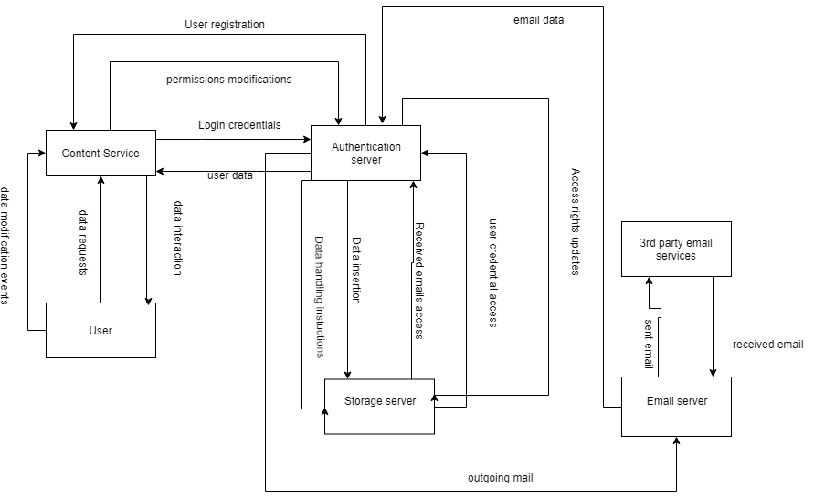
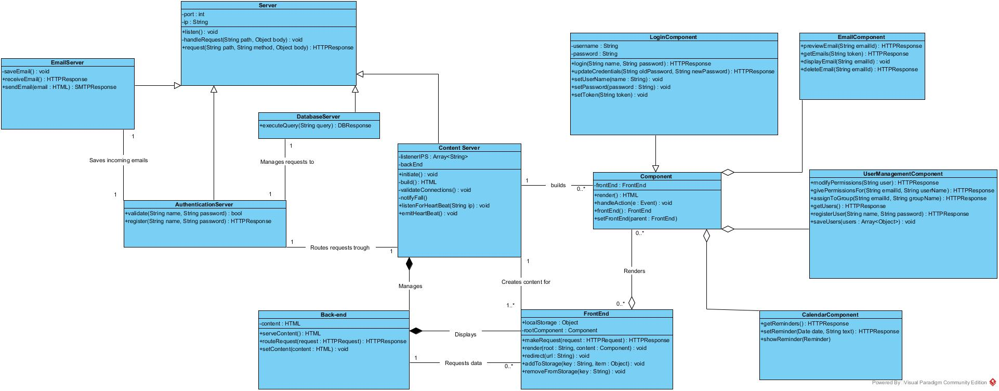

# Introduction

As our product is mainly web based, we choose the <b>Client-server<b> architecture.
We will separate each of our components into self contained services because:

* It's easier to modify and update each service, without others breaking.
* Services can be moved to cloud to allow:
  * Wider access range (not just from inside the home)
  * Easier service management
  * Cost reduction by only turning on services they are needed

## Overview

We will be basing our system on microservice architecture, we will have 4 main services running:

* Database service
* Email service
* Authentication service.
* Content service

### Email service

The purpose of this service is to:
* receive incoming emails and store them in the database.
* send out outgoing mail.
Because this is the most venerable part of the system, we only give it a very restricted access to our database. The only database feature it has access to is saving an incoming email. All of the other mail handling features are accessible trough the content service.

### Database service

Service that handles all data storage, insertions, modifications, and removal. It can only be accessed internally from the email service (with restrictions) or from the authentication service (full access).

### Authentication service

All requests for data modification, insertion, removal have to go trough this service. The main purpose is to validate user before database access, this way users can only modify data they have or are allow to access. Uses JWT token for authentication this will allow for stateless authentication, meaning that we can authenticate quicker and without needing extra database connection.

### Content service

This service is responsible for displaying and helping to visualise all of the other services that are available to the user.It handles all of the user interactions as well as displaying data to the user. This is the only service that a regular (non-admin) user will be accessing, it connects all of the other services together.

To make sure user is notified about any services going down, each service emits a heartbeat to let others know that it's alive. When content service is started it will listen to all available services and if any of them die, it will notify the user about the services that went down.

On starting it will:
* Build all of the content that will be server
* Initiate and validate service access

It's made of two parts: front-end and back-end. There can be multiple instances of front-end as each browser initiates a new one, however there is only one back-end server.

#### Front-end
* Handle user interactions with the UI
* Submit requests to back-end for further data access
* Acts as temporary storage for the data that user has requested in the session
* Visualise retrieved data
* Allows access from any browser
* Allows for users to make data handling requests
* Render user interface components

### Back-end
* Handle all requests made from the front-end
* Act as a middleman between all of the services and the front-end
* Serves the user interface components that the front-end will render
* Provides unique sessions for each user's device.

## Class diagram

